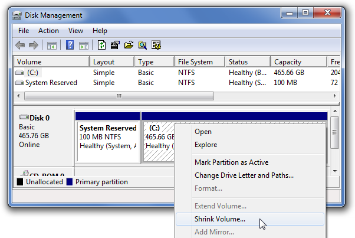
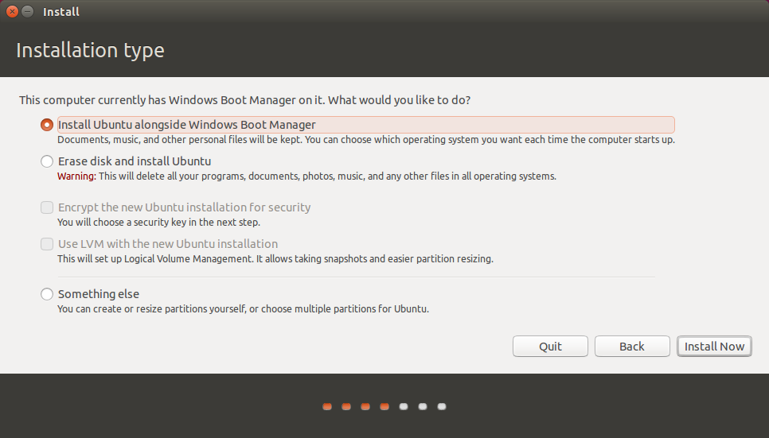
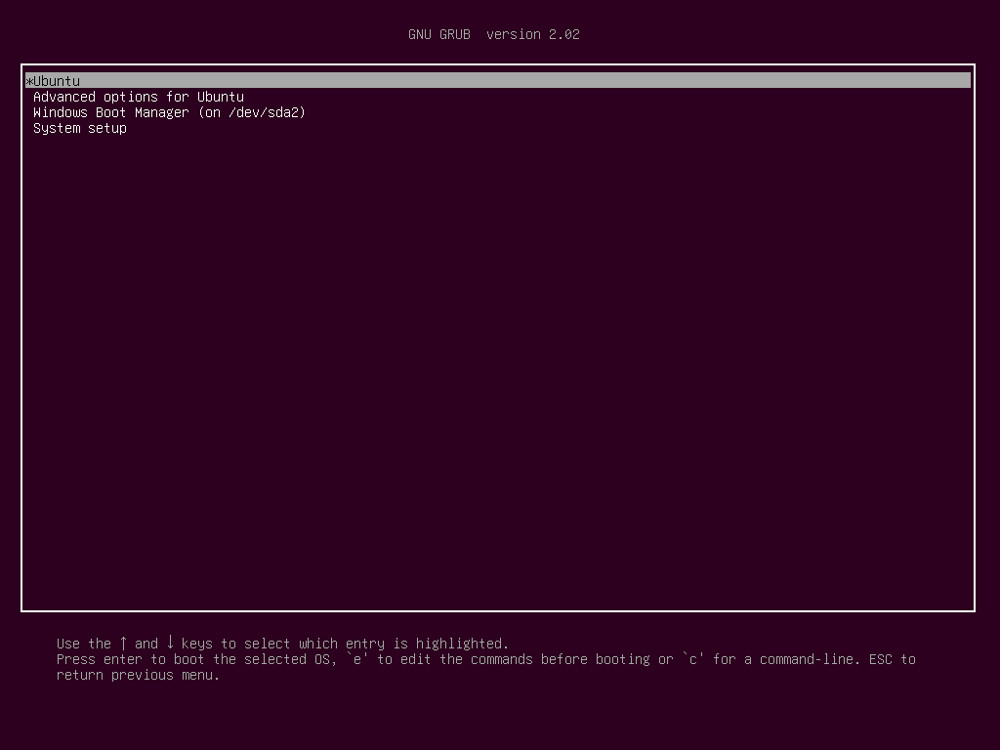
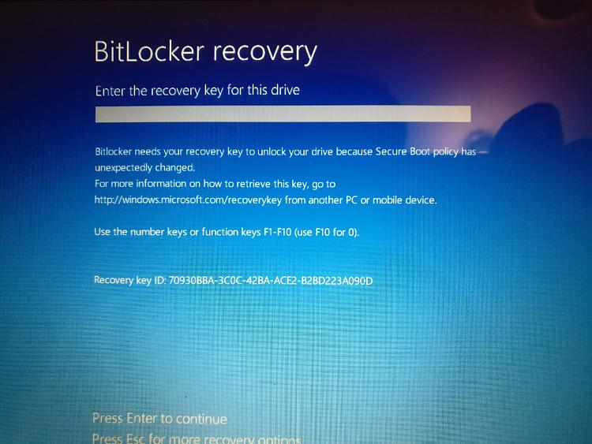

# Dual Boot Windows/Linux

## Assumptions

* Starting with a Windows 10+ install on a new machine with a Bitlocker encrypted drive
* Lcal admin rights to the Windows system
* A blank USB to boot from
* Downloaded the [rufus](https://rufus.ie/) live/bootable USB creator
* Downloaded an ISO for the Linux.
* Works best on a new system where there are no fragmented/unmoveable files in later blocks on the drive.

## Steps
-----------

### Shrink Windows
1. Navigate to _Control Panel_ / _Bitlocker_ (use the search box if the icon is not immediately shown)
2. Click on 'Turn Off Bitlocker' (decrypts the drive)
3. Navigate to _Computer Management_ / _Disk Management_
4. Shrink the main Windows partition by the MB you require for the Linux partition. Note; _Mb_ means 1000^2 in Windows, so you probably want to size your new partition in multiples of 1024 to have a nice looking GiB partition. So if you want 200Gib, use (1024 * 200) = 204800 Mb.

*Important* Don't mess with the system reserved, and/or manufacturers recovery partitions.

5. Navigate to _Control Panel_ / _Bitlocker_ (use the search box if the icon is not immediately shown)
6. Click on 'Turn On Bitlocker' (encrypts the drive again). This step will prompt you to save a new Bitlocker keyfile.

*Important, do not skip this step* : Save the keyfile to an external or secure cloud location. Bitlocker enforces you to save somewhere not on the drive about to be encrypted before it will continue.

### Create bootable/live USB of Linux distro
7. Open rufus and create a bootable USB

### Install Linux
8. Restart your system and press whatever key your hardware requires to go to the boot menu during the POST. F12 or F8 are common. Boot from the live USB.
9. This example is for Ubuntu 18.04.02. On the menu here, select to install Ubuntu.
10. On the next screen, select; "Install Ubuntu alongside Windows Boot Manager". The Ubuntu loader here realises that there is a single empty partition and automatically selects it. 

Important: if you have multiple disks and potential target partitions here, perhaps choose 'Something else' and view the partitions visually to verify the target is in the correct place.

11. Follow all the prompts and install Ubuntu.
12. Restart the machine, the grub menu has now replaced the default Windows boot manager / active partition. Ubuntu will always be the default (configurable later), but for now select Windows and continue.

### Enter your encryption key

14. _Windows/Bitlocker_ will give you a BSOD telling you the boot manager has been toyed with and request you to re-enter your encryption key to continue loading Windows. Retrieve your key from your external source and enter the long string of digits.

15. _Bitlocker_ should accept the code and boot sequence changes, and decrypt your drive. Now you're all good, use grub to select your OS.

Done!